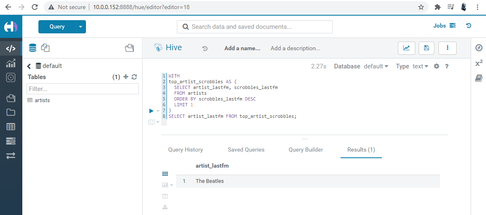
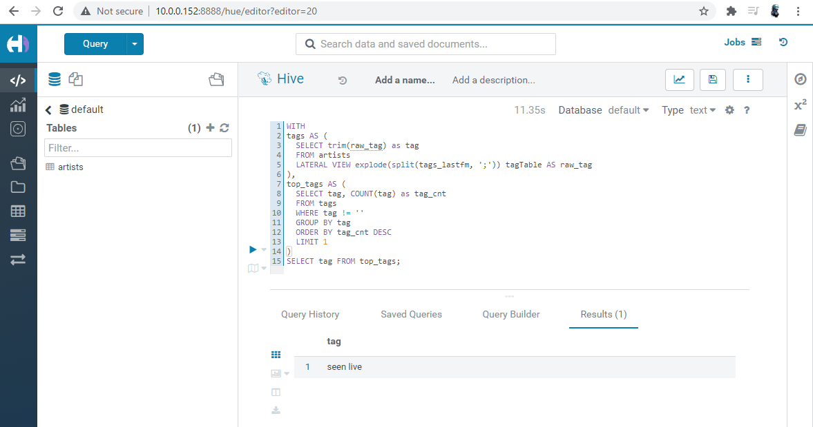
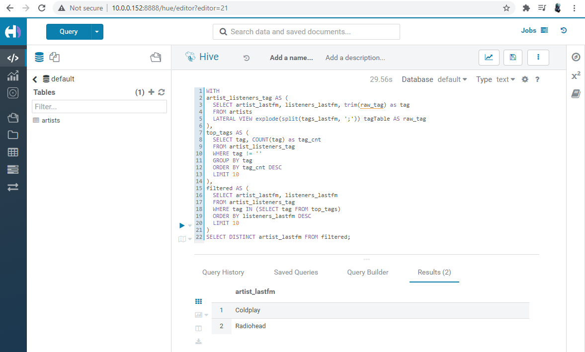
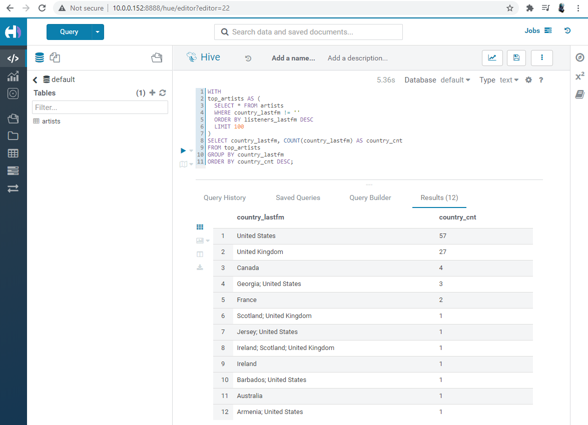

## Блок 1. Развёртывание локального Hive

- [X] 1. Развернуть локальный Hive в любой конфигурации (20 баллов).

  Использовалась конфигурация из репозитория: https://github.com/tech4242/docker-hadoop-hive-parquet

- [X] 2. Подключиться к развёрнутому Hive с помощью любого инструмента: Hue, Python Driver, Zeppelin, любая IDE и так далее (15 баллов за любой инструмент, максимум 30 баллов).

- [X] 3. Сделать скриншоты поднятого Hive и подключений в выбранными вами инструментах, добавить в репозиторий.
  - подкючение через Beeline:
  
  - подкючение через Hue:
  

## Блок 2. Работа с Hive

- [X] 1. Сделать таблицу artists в Hive и вставить туда значения, используя датасет https://www.kaggle.com/pieca111/music-artists-popularity (15 баллов).

  Загрузить файл через Hue не получилось в связи с непонятной ошибкой:
  

  Загрузка через терминал производилась следующим образом:
  ```bash
  docker cp artists.csv docker-hadoop-hive-parquet_hive-server_1:/opt
  docker-compose exec hive-server bash

  /opt/hive/bin/beeline -u jdbc:hive2://localhost:10000

  CREATE TABLE artists (mbid STRING, artist_mb STRING, artist_lastfm STRING, country_mb STRING, country_lastfm STRING, tags_mb STRING, tags_lastfm STRING, listeners_lastfm INT, scrobbles_lastfm INT, ambiguous_artist BOOLEAN) ROW FORMAT DELIMITED FIELDS TERMINATED BY ',' TBLPROPERTIES("skip.header.line.count"="1");

  LOAD DATA LOCAL INPATH '/opt/artists.csv' OVERWRITE INTO TABLE artists;
  ```
  

- [X] 2. Используя Hive, найти следующее (команды и результаты записать в файл и добавить в репозиторий):
  - [X] a) исполнителя с максимальным числом скробблов (5 баллов):
  ```sql
  SELECT artist_lastfm FROM (SELECT * FROM artists ORDER BY scrobbles_lastfm DESC LIMIT 1) x;
  ```
  
  - [X] b) самый популярный тег на ластфм (10 баллов). Самый популярный там пустой тег, но на него смотреть неинтересно (и невозможно), поэтому:
  ```sql
  SELECT tag FROM (
    SELECT tag, COUNT(tag) as tag_cnt
    FROM (
      SELECT trim(raw_tag) as tag FROM artists
      LATERAL VIEW explode(split(tags_lastfm, ';')) tagTable AS raw_tag
    ) x
    WHERE tag != ""
    GROUP BY tag
    ORDER BY tag_cnt DESC
    LIMIT 1
  ) y;
  ```
  
  - [X] c) самые популярные исполнители 10 самых популярных тегов ластфм (10 баллов):
  ```sql
  WITH
  artist_listeners_tag AS (
    SELECT artist_lastfm, listeners_lastfm, trim(raw_tag) as tag
    FROM artists
    LATERAL VIEW explode(split(tags_lastfm, ';')) tagTable AS raw_tag
  ),
  top_tags AS (
    SELECT tag, COUNT(tag) as tag_cnt
    FROM artist_listeners_tag
    WHERE tag != ''
    GROUP BY tag
    ORDER BY tag_cnt DESC
    LIMIT 10
  ),
  filtered AS (
    SELECT artist_lastfm, listeners_lastfm
    FROM artist_listeners_tag
    WHERE tag IN (SELECT tag FROM top_tags)
    ORDER BY listeners_lastfm DESC
    LIMIT 10
  )
  SELECT DISTINCT artist_lastfm FROM filtered;
  ```
  
  - [X] d) распределение стран ста самых популярных исполнителей (10 баллов):
  ```sql
  WITH
  top_artists AS (
    SELECT * FROM artists
    WHERE country_lastfm != ''
    ORDER BY listeners_lastfm DESC
    LIMIT 100
  )
  SELECT country_lastfm, COUNT(country_lastfm) AS country_cnt
  FROM top_artists
  GROUP BY country_lastfm
  ORDER BY country_cnt DESC;
  ```
  
