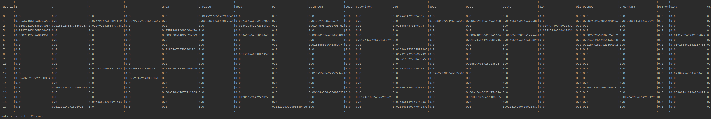

# TF-IDF с помощью Spark DataFrame API

## Dataset

Использован следующий датасет: https://www.kaggle.com/andrewmvd/trip-advisor-hotel-reviews

## Usage

* Загрузить датасет по ссылке выше.
* Распаковать датасет и положить `csv`-файл в `src/main/resources/`.
* Запустить `src/main/scala/tfidf/TfIdf.scala`.

Часть ожидаемого вывода:

